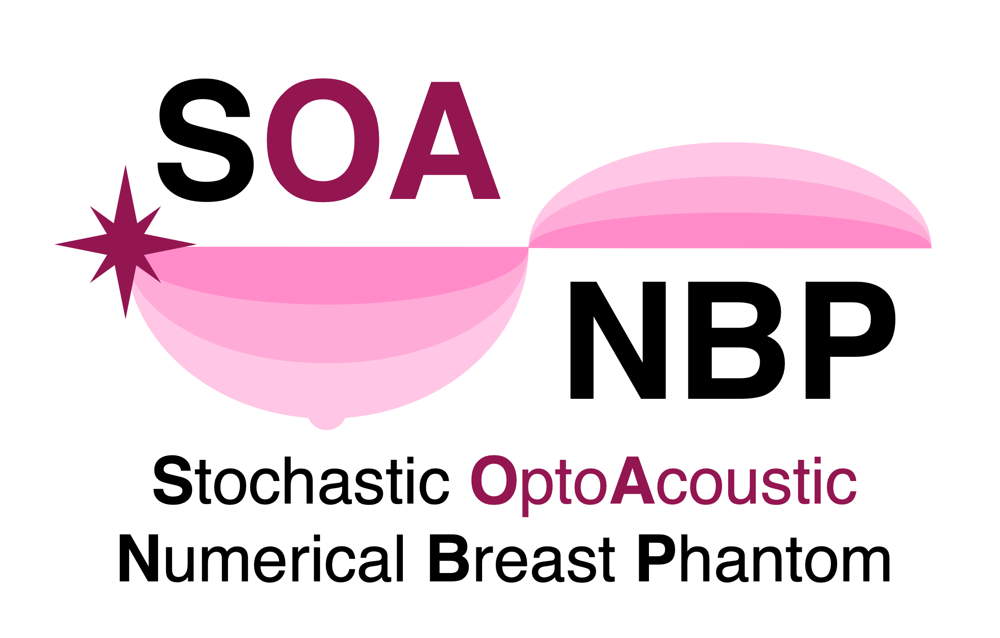

.. Welcome to Lumache's documentation!

SOA-NBP
===================================

Stochastic Optoacoustic Numerical Breast Phantom (**SOA-NBP**) is a software framework to stochastically generate three-dimensional (3D) distributions of the *functional*, *optical*, and *acousitc properties* of breasts and lesions for use in computational studies of **optical**, **acoustic**, and **optoacoustic (OA) imaging**, also known as **photoacoustic imaging**. The functional, optical, and acoustic numerical breast phatnoms (NBPs) are seperately established via assignmnet of the specific properties of breasts to each tissue type in the anatomical NBPs.

.. **Lumache** (/lu'make/) is a Python library for cooks and food lovers
.. that creates recipes mixing random ingredients.
.. It pulls data from the `Open Food Facts database <https://world.openfoodfacts.org/>`_
.. and offers a *simple* and *intuitive* API.

Check out the :doc:`usage` section for further information, including
how to :ref:`installation` the project.

.. note::

   This project is under active development.

Contents
--------

.. toctree::

   usage
   api
